  

# Desafio Técnico - Alpe  
### Tecnologias Utilizadas:
- Java
- Spring Boot
- Kafka
- SQLServer
- Docker
- JWT
___

## SOLUÇÂO 1: JSON (Implementado)

Nessa primeira solução, será pressupondo que seja enviado um _**JSON**_ para o microserviço de Notas Fiscais, o mesmo será validado no orgão do Governo (_mock_), em seguida salvo na base de dados, e por fim, enviado para outro microserviço de Cobrança (_mock_) - (**OBS**: se a nota Fiscal for paga como Boleto).

 

- Passo a Passo para executar o projeto:
1. Clonar o projeto através do [link.](https://github.com/DaviMachado/desafio_nota_fiscal_alpe)

2. Em seguida, será necessario executar o comando _"docker-compose up -d"_ dentro do diretorio do projeto clonado acima. (**OBS**: É necessario executar esse comando para subir os containers do SqlServer e do Kafka).

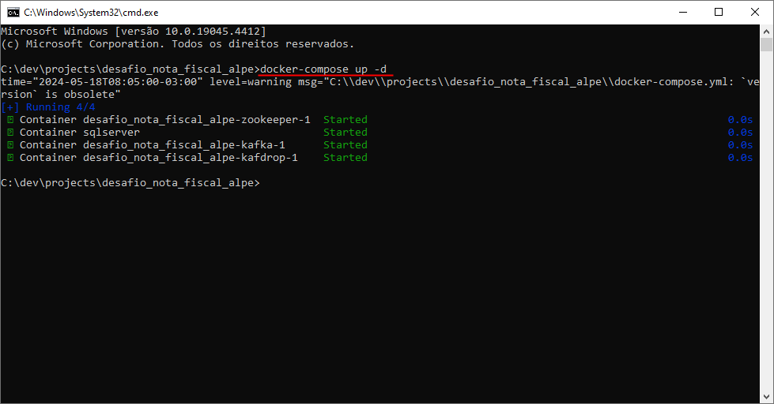 
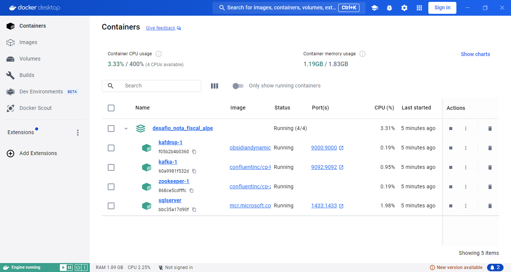 

3. Na sequência, será necesario criar as tabelas _**CLIENTE**_ e _**NOTA_FISCAL**_ no banco de dados. 

(**OBS**: Também será necessario realizar o **INSERT** do cliente, para prosseguir com os proximos passos).

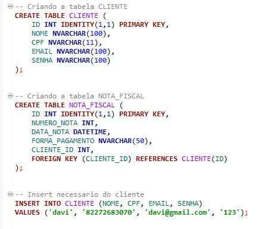 

4. Agora será necessário subir o microserviço que foi clonado na etapa 1.

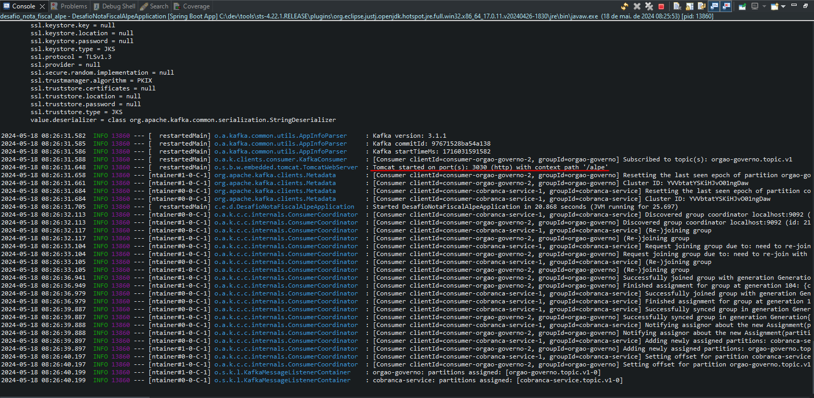  

5. Com o microserviço em execução, será necessario realizar o login para recuperar o token JWT, através do enpoint _http://localhost:3030/alpe/login_ 
(o login terá que ser com o mesmo cliente que foi realizado o **INSERT** na etapa 3).

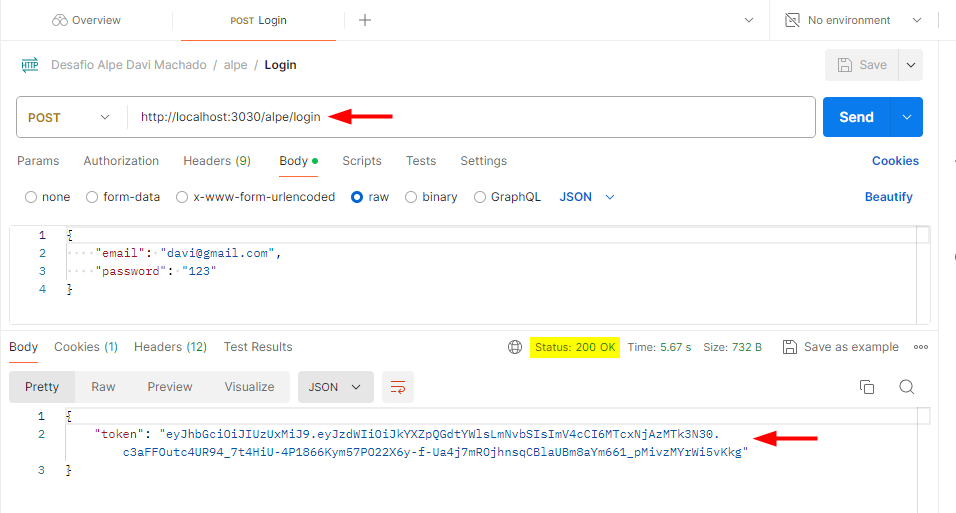 

6. Com o token gerado, será necesario adicionar esse token na aba "_Authorization_" nas proximas requisições.

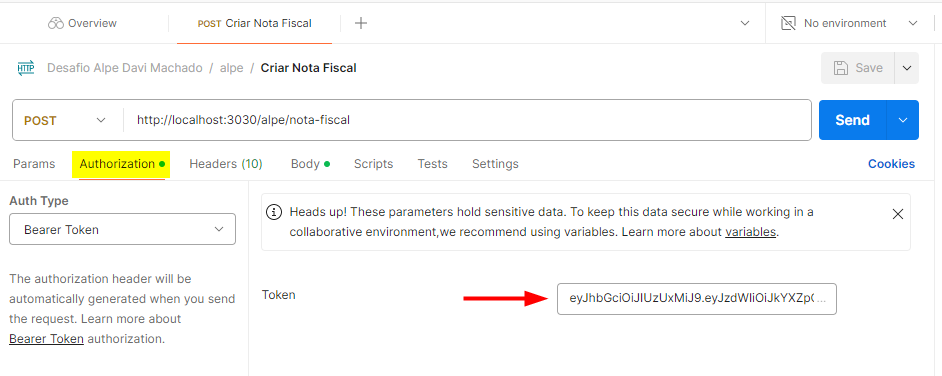 

- Agora é só salvar a Nota Fiscal através do endpoint _http://localhost:3030/alpe/nota-fiscal_.

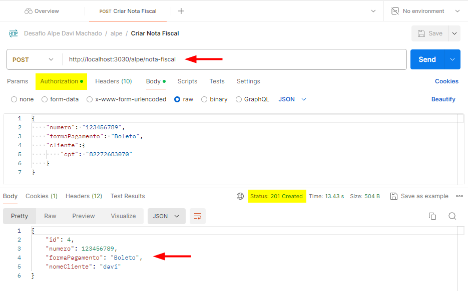 

7. O microserviço irá apresentar alguns logs, e um deles é o log do envio da Nota Fiscal para outro microserviço de Cobrança (_mock_), através do Kafka.

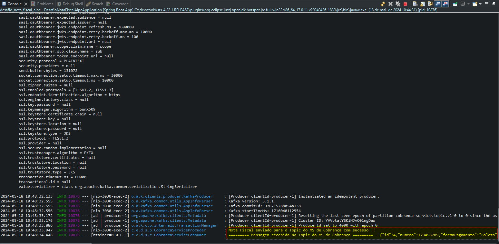

8. Por fim, a cobertura dos testes unitarios ficou em **79,9%** no _Coverage_.

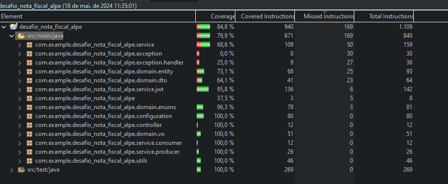 

___
___
## SOLUÇÂO 2: XML (**Implementado**)

Nessa segunda solução, será pressupondo que seja enviado um arquivo _**XML**_ para o microserviço de Notas Fiscais, o mesmo será validado no orgão do Governo (_mock_), em seguida salvo na base de dados e por fim, enviado para outro microserviço de Cobrança (_mock_) - (**OBS**: se a nota Fiscal for paga como Boleto).

- Passo a Passo:

1. Realizar o **login** conforme explicação acima e inserir o arquivo **XML** no seguinte endpoint _http://localhost:3030/alpe/nota-fiscal/upload-xml_ (arquivo **XML** encontra-se anexado dentro da pasta _"postman->xml"_ no projeto).

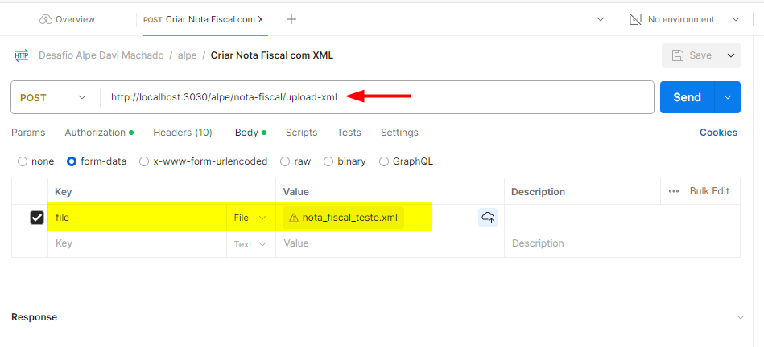

2. Ao executar esse endpoint _http://localhost:3030/alpe/nota-fiscal/upload-xml_, ele irá **desserializar** o arquivo **XML**, e salvar no banco de dados.

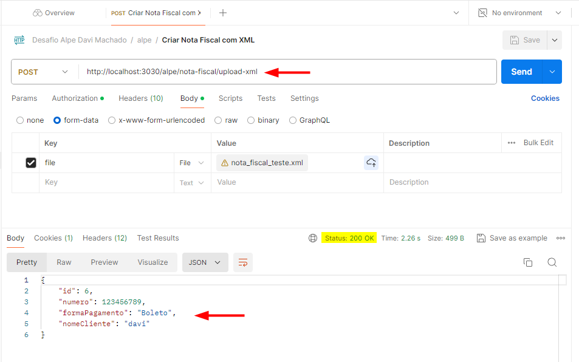

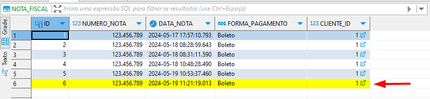

- **OBS**: O formato do arquivo **XML** segue o padrão que foi utilizado no teste (imagem abaixo), qualquer outro tipo de **XML** utilizado, irá apresentar erro.

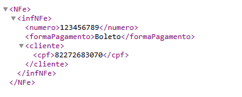

___
___
## SOLUÇÂO 3: S3 (**Não Implementado**)

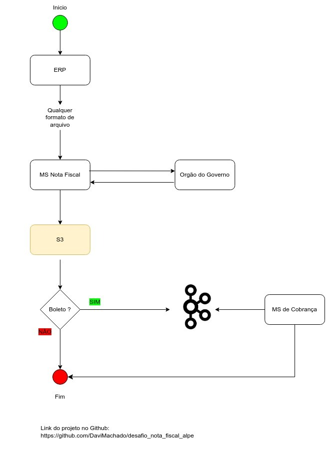 
